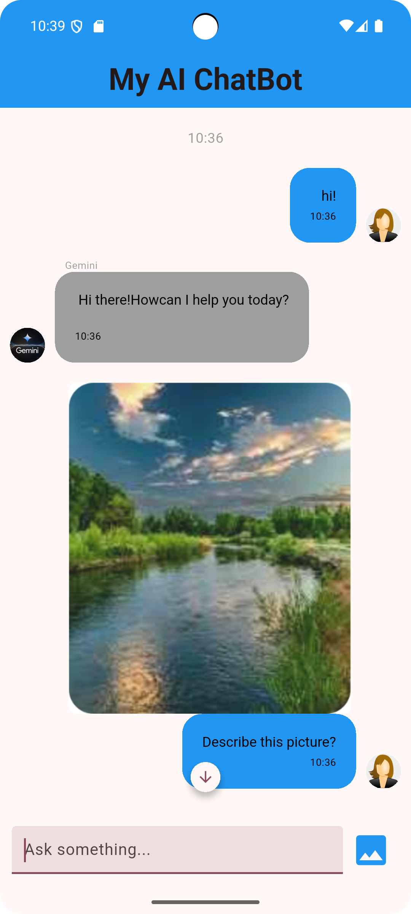
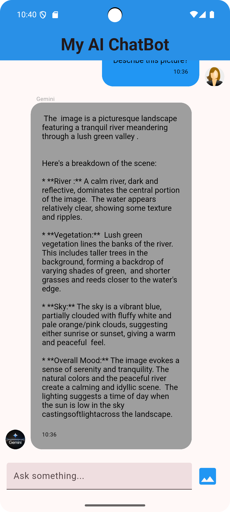
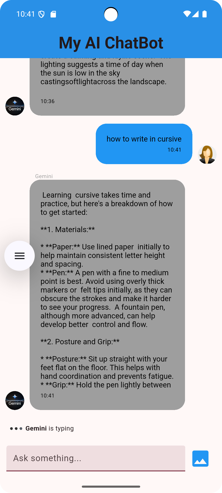

# chat_app

A new Flutter project for Team Nougat (Task 2).

## About this app

This is a chat bot app powered with the help of Gemini AI. It was made possible using flutter_gemini package.

Its a simple app designed to answer short queries and describe a picture with the help of Gemini.

This app was made for purpose of learning about how to integrate AI in a flutter app.

## Sreenshots

### A simple Hi message

### Describing a picture

### Detailed query and streaming responses

